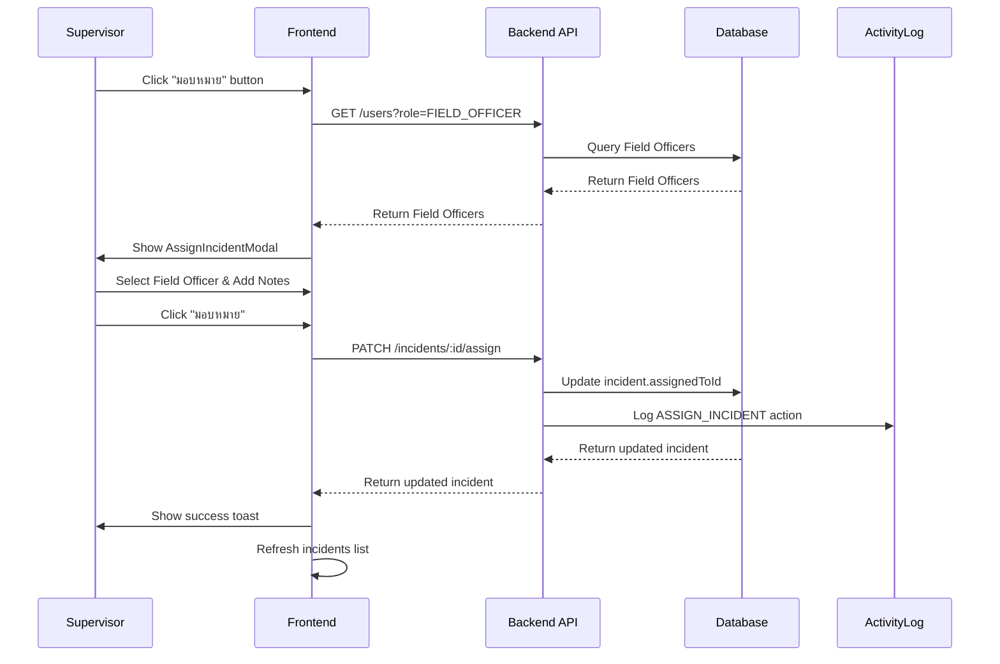
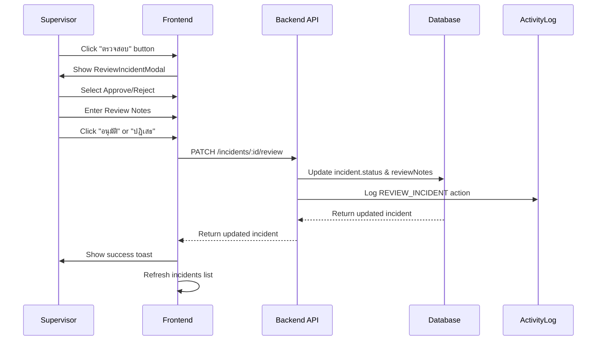

# Supervisor Module - Implementation Guide

**Project:** Guardian Route - Disaster Management System  
**Module:** Supervisor Module  
**Version:** 1.0.0  
**Last Updated:** November 9, 2025

---

## 📋 Overview

Supervisor Module เป็นส่วนหนึ่งของระบบ Guardian Route ที่ออกแบบมาเพื่อให้หัวหน้างาน (Supervisor) สามารถจัดการเหตุการณ์ภัยพิบัติได้อย่างมีประสิทธิภาพ โดยมีฟีเจอร์หลัก 2 ฟีเจอร์:

1. **Assign Incidents** - มอบหมายเหตุการณ์ให้กับเจ้าหน้าที่ภาคสนาม
2. **Review Incidents** - ตรวจสอบและอนุมัติ/ปฏิเสธเหตุการณ์

---

## 🎯 Features

### 1. Assign Incidents to Field Officers

**Description:**  
Supervisor สามารถมอบหมายเหตุการณ์ที่รายงานมาให้กับเจ้าหน้าที่ภาคสนาม (Field Officer) เพื่อให้ไปตรวจสอบและดำเนินการ

**User Story:**  
> As a Supervisor, I want to assign incidents to field officers so that they can investigate and take action on the ground.

**Acceptance Criteria:**
- ✅ Supervisor สามารถดูรายการเหตุการณ์ที่ยังไม่ได้มอบหมาย
- ✅ Supervisor สามารถเลือก Field Officer จากรายชื่อ
- ✅ Supervisor สามารถใส่หมายเหตุเพิ่มเติม (optional)
- ✅ ระบบบันทึกการมอบหมายใน ActivityLog
- ✅ Field Officer ได้รับ notification (future enhancement)

**UI Components:**
- `AssignIncidentModal` - Modal สำหรับมอบหมายงาน
- Field Officer dropdown (dynamic loading)
- Notes textarea (optional)
- Submit และ Cancel buttons

**API Endpoint:**
```
PATCH /incidents/:id/assign
Body: {
  fieldOfficerId: string,
  notes?: string
}
```

**Business Logic:**
1. ตรวจสอบว่า incident มี status = PENDING
2. ตรวจสอบว่า fieldOfficerId เป็น FIELD_OFFICER role
3. อัพเดท incident.assignedTo = fieldOfficerId
4. บันทึก ActivityLog
5. Return updated incident

---

### 2. Review and Approve/Reject Incidents

**Description:**  
Supervisor สามารถตรวจสอบเหตุการณ์ที่รายงานมา และตัดสินใจว่าจะอนุมัติให้ดำเนินการต่อ หรือปฏิเสธ

**User Story:**  
> As a Supervisor, I want to review reported incidents and approve or reject them so that only valid incidents are processed.

**Acceptance Criteria:**
- ✅ Supervisor สามารถดูรายละเอียดเหตุการณ์
- ✅ Supervisor สามารถเลือกอนุมัติหรือปฏิเสธ
- ✅ Supervisor ต้องใส่ความเห็นในการตรวจสอบ (required)
- ✅ Supervisor สามารถใส่หมายเหตุเพิ่มเติม (optional)
- ✅ เมื่ออนุมัติ: status เปลี่ยนเป็น INVESTIGATING
- ✅ เมื่อปฏิเสธ: status เปลี่ยนเป็น REJECTED
- ✅ ระบบบันทึกการตรวจสอบใน ActivityLog

**UI Components:**
- `ReviewIncidentModal` - Modal สำหรับตรวจสอบ
- Incident details display
- Review status radio buttons (Approve/Reject)
- Review notes textarea (required)
- Additional notes textarea (optional)
- Submit และ Cancel buttons

**API Endpoint:**
```
PATCH /incidents/:id/review
Body: {
  status: 'INVESTIGATING' | 'REJECTED',
  reviewNotes: string,
  additionalNotes?: string
}
```

**Business Logic:**
1. ตรวจสอบว่า incident มี status = PENDING
2. ตรวจสอบว่า reviewNotes ไม่ว่าง
3. อัพเดท incident.status ตามที่เลือก
4. อัพเดท incident.reviewNotes และ additionalNotes
5. บันทึก ActivityLog
6. Return updated incident

---

## 🏗️ Architecture

### Frontend Architecture

```
src/
├── components/
│   └── supervisor/
│       ├── AssignIncidentModal.tsx      # Modal สำหรับมอบหมายงาน
│       └── ReviewIncidentModal.tsx      # Modal สำหรับตรวจสอบ
├── api/
│   ├── incidents.ts                     # API methods (assign, review)
│   └── users.ts                         # API methods (getFieldOfficers)
└── types/
    └── index.ts                         # Type definitions
```

### Backend Architecture

```
backend/src/
├── incidents/
│   ├── incidents.controller.ts          # Endpoints (assign, review)
│   ├── incidents.service.ts             # Business logic
│   └── dto/
│       ├── assign-incident.dto.ts       # DTO for assign
│       └── review-incident.dto.ts       # DTO for review
└── common/
    └── activity-log.service.ts          # Audit trail service
```

---

## 📊 Database Schema

### Incident Model

```prisma
model Incident {
  id              String          @id @default(cuid())
  title           String
  description     String?
  status          IncidentStatus  @default(PENDING)
  priority        Priority        @default(MEDIUM)
  disasterType    DisasterType
  location        Json            // GeoJSON Point
  address         String?
  images          String[]
  villageId       String?
  reportedAt      DateTime        @default(now())
  resolvedAt      DateTime?
  reviewNotes     String?         // ← NEW: ความเห็นจากการตรวจสอบ
  additionalNotes String?         // ← NEW: หมายเหตุเพิ่มเติม
  createdById     String
  assignedToId    String?         // ← NEW: Field Officer ที่ได้รับมอบหมาย
  createdAt       DateTime        @default(now())
  updatedAt       DateTime        @updatedAt

  createdBy       User            @relation("IncidentCreator", fields: [createdById], references: [id])
  assignedTo      User?           @relation("IncidentAssignee", fields: [assignedToId], references: [id])
  village         Village?        @relation(fields: [villageId], references: [id])
  tasks           Task[]
  surveys         Survey[]
  reports         Report[]
  activityLogs    ActivityLog[]
}

enum IncidentStatus {
  PENDING         // รอการตรวจสอบ
  INVESTIGATING   // ← NEW: อนุมัติแล้ว กำลังตรวจสอบ
  IN_PROGRESS     // กำลังดำเนินการ
  RESOLVED        // แก้ไขแล้ว
  REJECTED        // ← NEW: ปฏิเสธ
  CLOSED          // ปิดงาน
}
```

### ActivityLog Model

```prisma
model ActivityLog {
  id          String   @id @default(cuid())
  action      String   // e.g., "ASSIGN_INCIDENT", "REVIEW_INCIDENT"
  details     Json     // { incidentId, fieldOfficerId, notes, etc. }
  userId      String
  incidentId  String?
  taskId      String?
  createdAt   DateTime @default(now())

  user        User      @relation(fields: [userId], references: [id])
  incident    Incident? @relation(fields: [incidentId], references: [id])
  task        Task?     @relation(fields: [taskId], references: [id])
}
```

---

## 🔐 Security & Authorization

### Role-Based Access Control (RBAC)

**Roles:**
- `FIELD_OFFICER` - รายงานเหตุการณ์, ดูเหตุการณ์ของตัวเอง
- `SUPERVISOR` - มอบหมาย, ตรวจสอบ, ดูเหตุการณ์ทั้งหมด
- `EXECUTIVE` - ดู analytics และรายงาน
- `ADMIN` - เข้าถึงทุกอย่าง

**Authorization Rules:**

| Action | FIELD_OFFICER | SUPERVISOR | EXECUTIVE | ADMIN |
|--------|---------------|------------|-----------|-------|
| View Unassigned Incidents | ❌ | ✅ | ✅ | ✅ |
| Assign Incident | ❌ | ✅ | ❌ | ✅ |
| Review Incident | ❌ | ✅ | ❌ | ✅ |
| View Activity Logs | ❌ | ✅ | ✅ | ✅ |

**Guards:**
- `@UseGuards(JwtAuthGuard, RolesGuard)`
- `@Roles(Role.SUPERVISOR, Role.ADMIN)`

---

## 🔄 Workflows

### Workflow 1: Assign Incident



### Workflow 2: Review Incident



---

## 🧪 Testing

### Unit Tests (Backend)

```typescript
describe('IncidentsService', () => {
  describe('assign', () => {
    it('should assign incident to field officer', async () => {
      // Test implementation
    });

    it('should throw error if incident not found', async () => {
      // Test implementation
    });

    it('should throw error if field officer not found', async () => {
      // Test implementation
    });

    it('should log activity', async () => {
      // Test implementation
    });
  });

  describe('review', () => {
    it('should approve incident', async () => {
      // Test implementation
    });

    it('should reject incident', async () => {
      // Test implementation
    });

    it('should require review notes', async () => {
      // Test implementation
    });

    it('should log activity', async () => {
      // Test implementation
    });
  });
});
```

### Integration Tests (E2E)

```typescript
describe('Supervisor Module (E2E)', () => {
  it('should assign incident to field officer', async () => {
    // Login as supervisor
    // Create incident
    // Assign to field officer
    // Verify assignment
    // Verify activity log
  });

  it('should review and approve incident', async () => {
    // Login as supervisor
    // Create incident
    // Review and approve
    // Verify status change
    // Verify activity log
  });

  it('should review and reject incident', async () => {
    // Login as supervisor
    // Create incident
    // Review and reject
    // Verify status change
    // Verify activity log
  });
});
```

---

## 📱 User Interface

### AssignIncidentModal

**Layout:**
```
┌─────────────────────────────────────┐
│ มอบหมายเหตุการณ์                [X] │
├─────────────────────────────────────┤
│                                     │
│ หัวข้อ: น้ำท่วมบ้านเรือน            │
│ รายละเอียด: น้ำท่วมสูง 50 ซม.      │
│                                     │
│ เลือกเจ้าหน้าที่ภาคสนาม *          │
│ ┌─────────────────────────────┐   │
│ │ -- เลือกเจ้าหน้าที่ --      ▼│   │
│ └─────────────────────────────┘   │
│                                     │
│ หมายเหตุ (ถ้ามี)                   │
│ ┌─────────────────────────────┐   │
│ │                             │   │
│ │                             │   │
│ └─────────────────────────────┘   │
│                                     │
│          [ยกเลิก]  [มอบหมาย]      │
└─────────────────────────────────────┘
```

### ReviewIncidentModal

**Layout:**
```
┌─────────────────────────────────────┐
│ ตรวจสอบเหตุการณ์                [X] │
├─────────────────────────────────────┤
│                                     │
│ ┌─────────────────────────────────┐│
│ │ หัวข้อ: น้ำท่วมบ้านเรือน        ││
│ │ รายละเอียด: น้ำท่วมสูง 50 ซม.  ││
│ │ [น้ำท่วม] [สูง] [รอดำเนินการ]  ││
│ │ หมู่บ้าน: บ้านดอน               ││
│ │ รายงานโดย: สมชาย ใจดี           ││
│ └─────────────────────────────────┘│
│                                     │
│ ผลการตรวจสอบ *                     │
│ ○ อนุมัติ (ส่งต่อเพื่อดำเนินการ)  │
│ ○ ปฏิเสธ (ไม่ดำเนินการ)           │
│                                     │
│ ความเห็นในการตรวจสอบ *             │
│ ┌─────────────────────────────┐   │
│ │                             │   │
│ │                             │   │
│ └─────────────────────────────┘   │
│                                     │
│ หมายเหตุเพิ่มเติม (ถ้ามี)          │
│ ┌─────────────────────────────┐   │
│ │                             │   │
│ └─────────────────────────────┘   │
│                                     │
│          [ยกเลิก]  [อนุมัติ]       │
└─────────────────────────────────────┘
```

---

## 🚀 Deployment

### Environment Variables

ไม่มี environment variables ใหม่ที่ต้องเพิ่ม

### Database Migration

```bash
# Generate migration
npx prisma migrate dev --name add_supervisor_fields

# Apply migration
npx prisma migrate deploy
```

### Build & Deploy

```bash
# Backend
cd backend
npm run build
npm run start:prod

# Frontend
cd frontend
npm run build
# Deploy dist/ to web server
```

---

## 📚 API Documentation

### GET /incidents/unassigned

**Description:** ดึงรายการเหตุการณ์ที่ยังไม่ได้มอบหมาย

**Authorization:** SUPERVISOR, ADMIN

**Response:**
```json
[
  {
    "id": "clx123...",
    "title": "น้ำท่วมบ้านเรือน",
    "description": "น้ำท่วมสูง 50 ซม.",
    "status": "PENDING",
    "priority": "HIGH",
    "disasterType": "FLOOD",
    "location": {
      "type": "Point",
      "coordinates": [99.8325, 19.9071]
    },
    "reportedAt": "2025-11-09T10:30:00Z",
    "createdBy": {
      "id": "user123",
      "firstName": "สมชาย",
      "lastName": "ใจดี"
    },
    "village": {
      "id": "village1",
      "name": "บ้านดอน"
    }
  }
]
```

### PATCH /incidents/:id/assign

**Description:** มอบหมายเหตุการณ์ให้ Field Officer

**Authorization:** SUPERVISOR, ADMIN

**Request Body:**
```json
{
  "fieldOfficerId": "user456",
  "notes": "กรุณาตรวจสอบพื้นที่โดยเร็ว"
}
```

**Response:**
```json
{
  "id": "clx123...",
  "title": "น้ำท่วมบ้านเรือน",
  "status": "PENDING",
  "assignedToId": "user456",
  "assignedTo": {
    "id": "user456",
    "firstName": "สมหญิง",
    "lastName": "ขยัน"
  }
}
```

### PATCH /incidents/:id/review

**Description:** ตรวจสอบและอนุมัติ/ปฏิเสธเหตุการณ์

**Authorization:** SUPERVISOR, ADMIN

**Request Body:**
```json
{
  "status": "INVESTIGATING",
  "reviewNotes": "เหตุการณ์มีความสำคัญ ควรดำเนินการโดยเร็ว",
  "additionalNotes": "ติดต่อผู้ใหญ่บ้านเพื่อประสานงาน"
}
```

**Response:**
```json
{
  "id": "clx123...",
  "title": "น้ำท่วมบ้านเรือน",
  "status": "INVESTIGATING",
  "reviewNotes": "เหตุการณ์มีความสำคัญ ควรดำเนินการโดยเร็ว",
  "additionalNotes": "ติดต่อผู้ใหญ่บ้านเพื่อประสานงาน"
}
```

---

## 🐛 Known Issues

ไม่มี known issues ในขณะนี้

---

## 🔮 Future Enhancements

1. **Real-time Notifications**
   - แจ้งเตือน Field Officer เมื่อได้รับมอบหมายงาน
   - แจ้งเตือน Supervisor เมื่อมีเหตุการณ์ใหม่

2. **Bulk Operations**
   - มอบหมายหลายเหตุการณ์พร้อมกัน
   - ตรวจสอบหลายเหตุการณ์พร้อมกัน

3. **Advanced Filtering**
   - Filter ตาม date range
   - Filter ตาม village
   - Filter ตาม disaster type

4. **Analytics Dashboard**
   - จำนวนเหตุการณ์ที่มอบหมาย
   - จำนวนเหตุการณ์ที่อนุมัติ/ปฏิเสธ
   - Average response time

5. **Mobile App**
   - Supervisor mobile app
   - Push notifications

---

## 📞 Support

**Developer:** System Development Team  
**Email:** dev@guardianroute.local  
**Documentation:** [Guardian Route Developer Handbook](../Guardian_Route_Developer_Handbook.md)

---

**Document Version:** 1.0.0  
**Last Updated:** November 9, 2025  
**Status:** ✅ Complete
