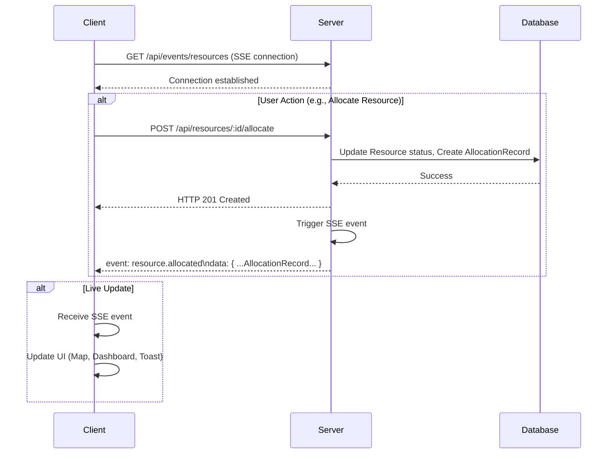

# Sprint 10: Resource Availability + Real-Time Tracking - Technical Specification

**Version:** 1.0
**Date:** 2025-11-10
**Author:** Manus AI

## 1. Overview

This document outlines the technical design for Sprint 10, which focuses on implementing a real-time resource tracking system. The goal is to provide live updates on resource status, location, and availability to authorized users (ADMIN, SUPERVISOR, EXECUTIVE) using Server-Sent Events (SSE).

## 2. Real-Time Mechanism: Server-Sent Events (SSE)

We will use SSE for its simplicity and suitability for one-way server-to-client communication. This avoids the complexity of WebSockets for this use case.

### 2.1. SSE Endpoint

- **URL:** `/api/events/resources`
- **Method:** `GET`
- **Content-Type:** `text/event-stream`
- **Authentication:** JWT token
- **Roles:** ADMIN, SUPERVISOR, EXECUTIVE

### 2.2. Event Types

The server will push events with the following types:

| Event Name | Data Payload | Trigger |
| :--- | :--- | :--- |
| `resource.created` | `Resource` | A new resource is created |
| `resource.updated` | `Resource` | A resource's details are updated |
| `resource.deleted` | `{ id: string }` | A resource is deleted |
| `resource.allocated` | `AllocationRecord` | A resource is allocated to a task |
| `resource.reclaimed` | `AllocationRecord` | A resource is reclaimed |

### 2.3. Data Flow Diagram (Mermaid)



## 3. Backend Design (NestJS)

### 3.1. Events Module

We will create a new `EventsModule` to handle SSE connections and event broadcasting.

- **`EventsController`**: Manages the `/events/resources` endpoint.
- **`EventsService`**: Handles event broadcasting to connected clients.
  - `subscribe(client)`: Adds a client to the subscriber list.
  - `unsubscribe(client)`: Removes a client.
  - `sendEvent(event, data)`: Sends an event to all subscribers.

### 3.2. Integration with ResourceService

The `ResourceService` will be updated to inject the `EventsService` and broadcast events after successful database operations.

```typescript
// Example in ResourceService

@Injectable()
export class ResourceService {
  constructor(
    private prisma: PrismaService,
    private eventsService: EventsService
  ) {}

  async allocate(resourceId: string, taskId: string, userId: string) {
    // ... allocation logic ...

    const allocationRecord = await this.prisma.allocationRecord.create(...);

    // Broadcast event
    this.eventsService.sendEvent(
      'resource.allocated',
      allocationRecord
    );

    return allocationRecord;
  }
}
```

## 4. Frontend Design (React)

### 4.1. SSE Hook (`useResourceEvents.ts`)

A new hook will be created to manage the SSE connection.

- **Functionality:**
  - Establishes and maintains the `EventSource` connection.
  - Listens for different event types (`resource.created`, `resource.updated`, etc.).
  - Dispatches actions or updates state based on received events.
  - Handles reconnection logic.

### 4.2. Component Architecture

- **`ResourceAvailabilityDashboard.tsx`**: A new page to display live resource status.
  - Uses `useResourceEvents` to get live updates.
  - Contains a grid of `ResourceCard` components.

- **`RealTimeMap.tsx`**: A new map component for live tracking.
  - Displays resource markers with status-based colors.
  - Updates marker positions and popups in real-time based on SSE events.

- **`NotificationProvider.tsx`**: A context provider to show toast notifications for resource changes.

## 5. Database Schema

No major schema changes are required for this sprint. We will leverage the existing `Resource` and `AllocationRecord` models.

## 6. API Contracts (No new endpoints, only SSE)

All actions are triggered by existing REST API calls. The only new communication channel is the SSE endpoint.

## 7. Testing Plan

- **Backend:** Unit tests for `EventsService`.
- **Frontend:** Manual testing of real-time updates on the dashboard and map.
- **E2E:** Simulate a user action and verify that another user receives the live update.
