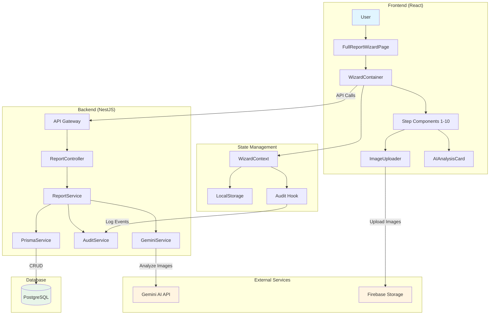
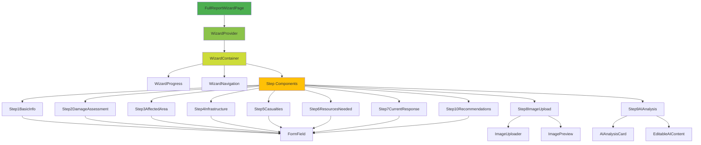
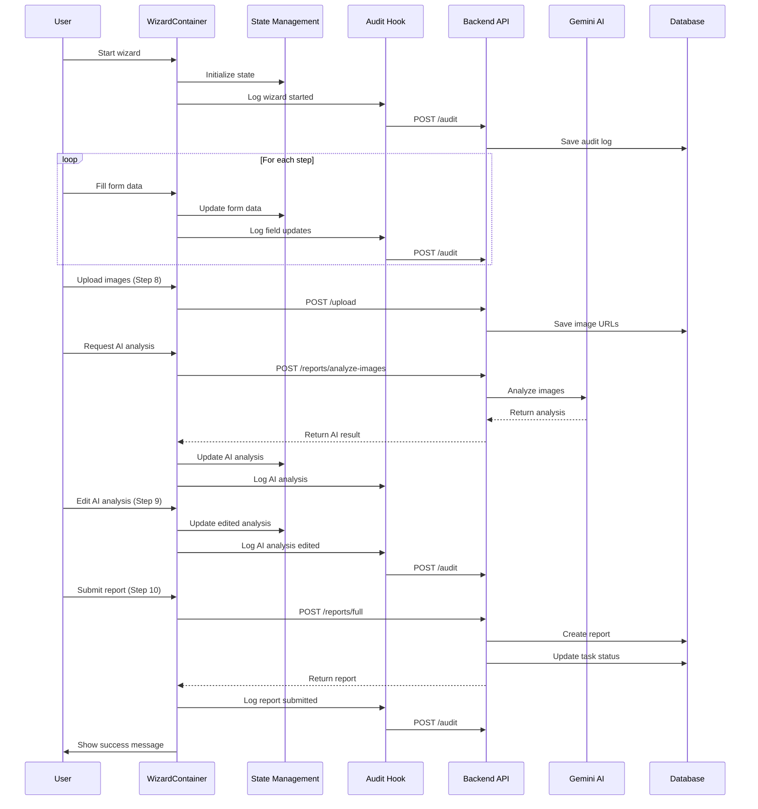
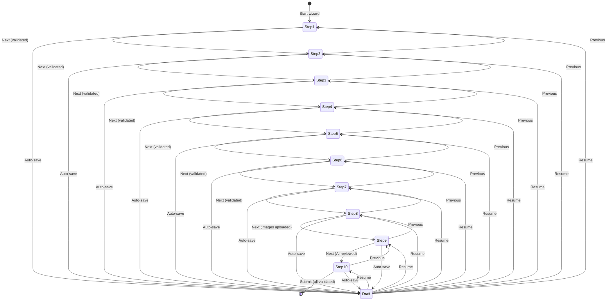
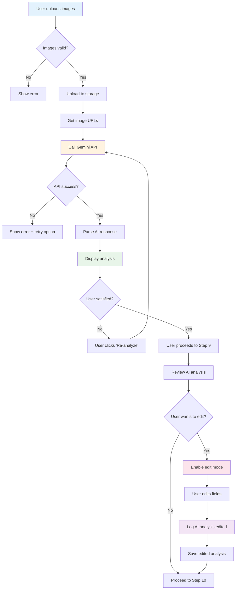
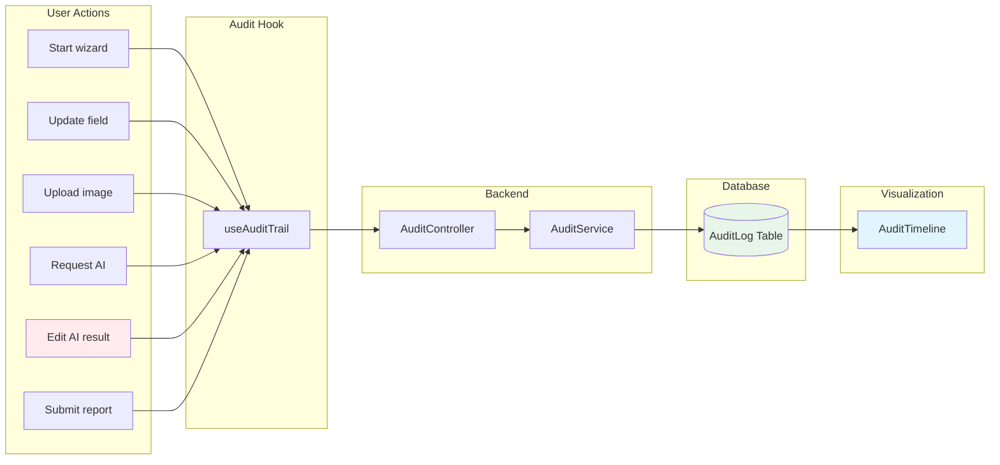
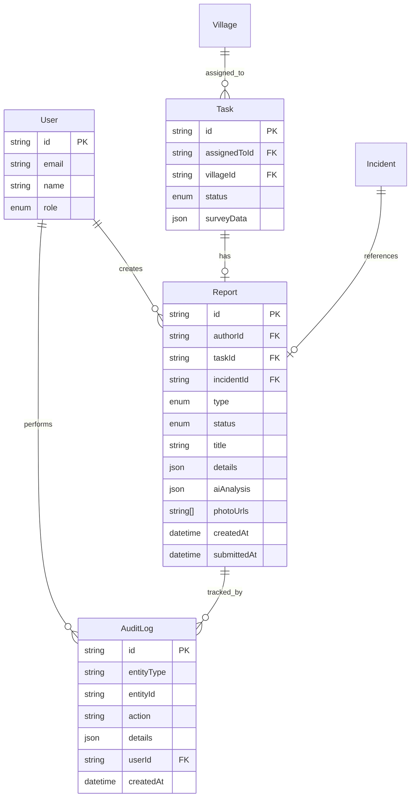
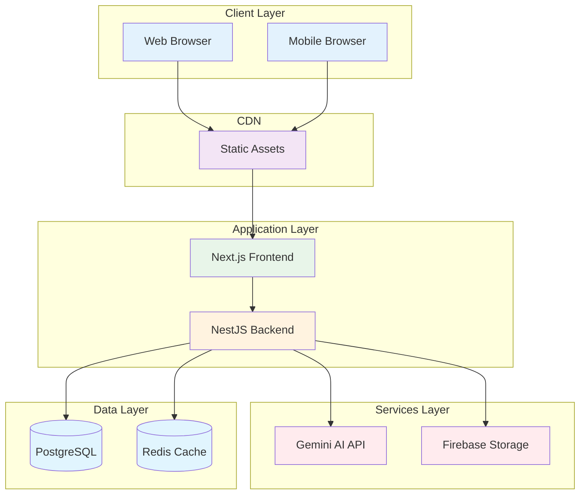
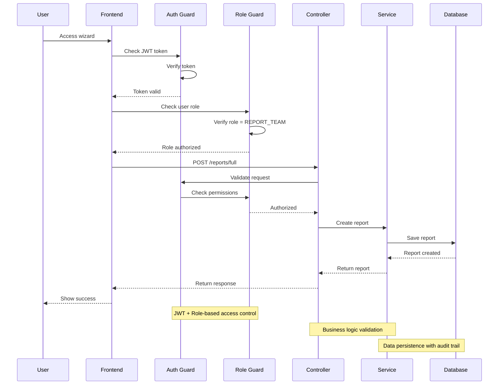

# Sprint 6: Architecture Diagrams

**Document Version:** 1.0  
**Date:** Nov 09, 2025  
**Author:** Manus AI

---

## 1. System Architecture Overview



---

## 2. Component Hierarchy



---

## 3. Data Flow Diagram



---

## 4. Wizard State Flow



---

## 5. AI Analysis Flow



---

## 6. Audit Trail Flow



---

## 7. Database Schema Relationships



---

## 8. API Architecture

```mermaid
graph LR
    subgraph "Frontend"
        A[React App]
    end
    
    subgraph "API Layer"
        B[/api/reports/full]
        C[/api/reports/analyze-images]
        D[/api/reports/drafts]
        E[/api/tasks/:id/preliminary-data]
        F[/api/audit]
    end
    
    subgraph "Controllers"
        G[ReportController]
        H[TaskController]
        I[AuditController]
    end
    
    subgraph "Services"
        J[ReportService]
        K[GeminiService]
        L[AuditService]
        M[TaskService]
    end
    
    subgraph "External"
        N[Gemini AI API]
        O[Firebase Storage]
    end
    
    A -->|POST| B
    A -->|POST| C
    A -->|POST/GET| D
    A -->|GET| E
    A -->|POST| F
    
    B --> G
    C --> G
    D --> G
    E --> H
    F --> I
    
    G --> J
    G --> K
    H --> M
    I --> L
    
    K --> N
    J --> O
    
    style A fill:#e3f2fd
    style N fill:#fff3e0
    style O fill:#fff3e0
```

---

## 9. Deployment Architecture



---

## 10. Security Flow



---

## Summary

This document provides:
- **System architecture overview** showing all major components
- **Component hierarchy** for the wizard UI
- **Data flow diagrams** for user interactions
- **State management flow** with draft persistence
- **AI analysis flow** with error handling
- **Audit trail flow** for complete traceability
- **Database schema** with relationships
- **API architecture** showing endpoints and services
- **Deployment architecture** for production
- **Security flow** with authentication and authorization

All diagrams are in Mermaid format and can be rendered in Markdown viewers or documentation tools.
