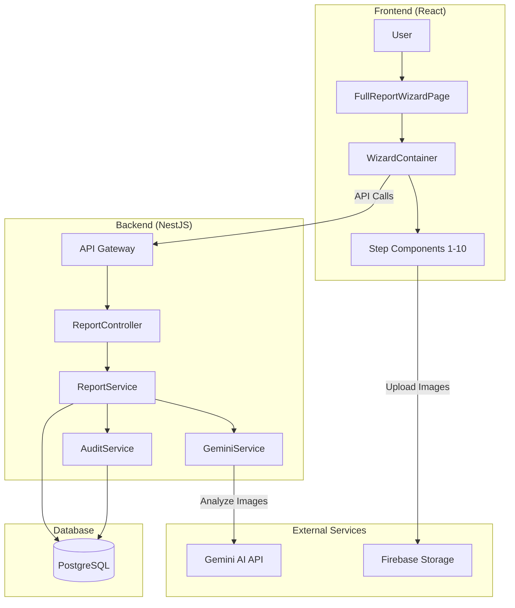
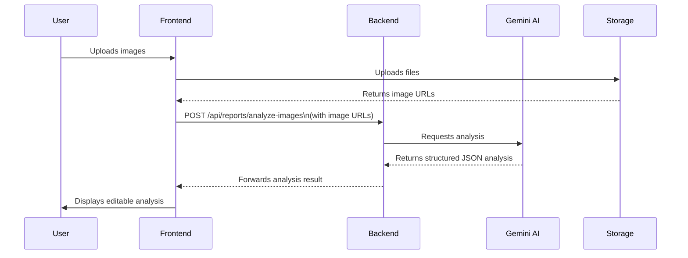

# Sprint 6: Full Report System - Technical Specification

**Document Version:** 1.0  
**Date:** Nov 09, 2025  
**Author:** Manus AI
**Status:** DRAFT FOR REVIEW

---

## 1. Introduction

This document provides a comprehensive technical specification for the development of the **Full Report System** as part of **Sprint 6**. This system is designed for the **Report Team** to create detailed, multi-step disaster reports based on preliminary data collected by Field Officers. 

The key features include a 10-step wizard form, integration with Gemini AI for image analysis, robust data validation, and a complete audit trail for all significant actions, as mandated by the System Analyst (SA).

### 1.1. Scope & Objectives

- **Objective:** To build a secure, reliable, and user-friendly system for creating comprehensive disaster reports.
- **Scope:** The development covers five main features:
  1.  Fetching and pre-filling data from preliminary surveys.
  2.  A 10-step wizard form for detailed data entry.
  3.  Image upload and AI-powered analysis using Gemini API.
  4.  Displaying and allowing edits to AI-generated insights.
  5.  Submitting the final report and updating the task status to `PENDING_REVIEW`.

### 1.2. Key Stakeholders

- **System Analyst (SA):** Approver of specifications and final deliverables.
- **Report Team:** Primary users of the system.
- **Supervisors/Admins:** Reviewers and approvers of the final reports.
- **Development Team:** Responsible for implementation and delivery.

---


## 2. Gemini AI Integration Strategy

This section outlines the strategy for integrating the Gemini AI API to analyze disaster images, as researched and documented in `gemini-api-research.md`.

### 2.1. Capabilities & Recommended Model

Gemini's native multimodal capabilities will be leveraged for image captioning, classification, and object detection. The recommended model for this sprint is **`gemini-2.5-flash`**, which provides an optimal balance of speed, accuracy, and cost for real-time analysis.

### 2.2. API Integration Flow

1.  **Image Upload:** The user uploads up to 5 images (max 20MB each) via the frontend.
2.  **Backend Request:** The frontend sends the image URLs to a new backend endpoint: `POST /api/reports/analyze-images`.
3.  **Gemini API Call:** The backend's `GeminiService` calls the Gemini Vision API with the images and a structured prompt.
4.  **Structured Output:** The API is configured to return a JSON object with a predefined schema, ensuring consistent and parsable results.
5.  **Response to Frontend:** The backend forwards the structured AI analysis to the frontend.
6.  **Display & Edit:** The frontend displays the analysis in an `AIAnalysisCard` and allows the user to edit the results.

### 2.3. Data Model for AI Analysis

```typescript
export interface AIAnalysisResult {
  damageLevel: 'low' | 'medium' | 'high' | 'critical';
  damageTypes: string[];
  affectedStructures: string[];
  riskFactors: string[];
  summary: string;
  confidence: number; // 0-1
  tags: string[];
  analyzedAt: Date;
  modelVersion: string;
}
```

### 2.4. Prompt Engineering

A standardized prompt will be used to ensure consistent analysis across all reports. The prompt will explicitly ask for a JSON output matching the `AIAnalysisResult` interface.

**Prompt Template:**
```
วิเคราะห์ภาพภัยพิบัติต่อไปนี้และให้ข้อมูลตามโครงสร้าง JSON ที่กำหนด:

1.  **damageLevel**: ระดับความเสียหาย (low, medium, high, critical)
2.  **damageTypes**: ประเภทความเสียหายที่พบ (เช่น อาคารพัง, น้ำท่วม)
3.  **affectedStructures**: โครงสร้างที่ได้รับผลกระทบ (เช่น บ้านเรือน, ถนน)
4.  **riskFactors**: ปัจจัยเสี่ยงที่อาจเกิดขึ้น (เช่น โครงสร้างไม่มั่นคง)
5.  **summary**: สรุปสถานการณ์โดยรวม
6.  **confidence**: ระดับความมั่นใจในการวิเคราะห์ (0.0 - 1.0)
7.  **tags**: คำสำคัญที่เกี่ยวข้อง

กรุณาตอบเป็น JSON object เท่านั้น
```

---


## 3. System Architecture & Component Design

This section details the frontend and backend architecture, component hierarchy, and state management strategy, as documented in `component-architecture.md`.

### 3.1. High-Level Architecture

The system follows a modern web architecture with a React frontend, a NestJS backend, and integration with external services for AI analysis and file storage. A PostgreSQL database serves as the primary data store.

*(For a visual representation, see the System Architecture Overview diagram in Section 7.)*

### 3.2. Frontend Component Hierarchy

The frontend is structured around a main `FullReportWizardPage` that contains the `WizardContainer`. The container manages the state and navigation for the 10 step-components. Reusable shared components for form fields, image uploading, and AI display are used across the steps to ensure consistency and maintainability.

**Key Components:**
-   **`WizardContainer.tsx`**: The orchestrator for the entire wizard flow.
-   **`Step*.tsx`**: Individual components for each of the 10 steps.
-   **`ImageUploader.tsx`**: A shared component for handling file uploads.
-   **`AIAnalysisCard.tsx`**: A shared component for displaying AI-generated results.
-   **`useWizardState.ts`**: A custom hook (or context) for managing the wizard's state.

*(For a detailed breakdown, see the Component Hierarchy diagram in Section 7.)*

### 3.3. State Management

A React Context (`WizardContext`) will be used for managing the global state of the wizard. This approach is chosen for its simplicity and lack of external dependencies. The context will provide:

-   The current state of the form data (`formData`).
-   The current step number (`currentStep`).
-   Navigation functions (`nextStep`, `prevStep`, `goToStep`).
-   Functions for saving drafts and submitting the final report.

Drafts will be auto-saved to the backend every 30 seconds and also backed up to `localStorage` to prevent data loss.

---


## 4. Data Models, Validation, and API Contracts

This section defines the data structures, validation rules, and API endpoints that will be used throughout the system, as detailed in `data-models-and-api.md`.

### 4.1. Data Models

-   **`FullReportFormData` (Frontend):** A comprehensive interface representing all data collected across the 10 wizard steps.
-   **`CreateFullReportDto` (Backend):** A Data Transfer Object used for creating a new full report. It includes extensive validation decorators (`class-validator`) to ensure data integrity.
-   **`AIAnalysisResult`:** A shared interface for the structured output from the Gemini API.

### 4.2. Validation Strategy

Validation will be implemented at multiple layers:

1.  **Client-Side (Zod):** Each wizard step will have its own Zod schema for real-time, client-side validation, providing immediate feedback to the user.
2.  **Server-Side (NestJS Pipes):** The backend will use `ValidationPipe` with `class-validator` decorators on all DTOs to reject any invalid requests before they reach the service layer.
3.  **Cross-Field Validation:** Complex business rules (e.g., requiring casualty details if the number of casualties is greater than zero) will be implemented using Zod's `.refine()` method on the frontend and custom validators on the backend.

### 4.3. API Endpoints

Several new endpoints will be created to support the full report workflow:

| Method | Endpoint                          | Description                               |
| :----- | :-------------------------------- | :---------------------------------------- |
| `POST` | `/api/reports/full`               | Creates a new full report.                |
| `POST` | `/api/reports/analyze-images`     | Analyzes uploaded images using Gemini AI. |
| `GET`  | `/api/reports/drafts`             | Retrieves a user's saved drafts.          |
| `POST` | `/api/reports/drafts`             | Saves a report as a draft.                |
| `GET`  | `/api/tasks/:taskId/preliminary-data` | Fetches data from the preliminary survey. |

All endpoints will be protected by `JwtAuthGuard` and `RolesGuard` to ensure only authorized users (i.e., `REPORT_TEAM`) can access them.

---


## 5. Audit Trail Implementation

As per the SA mandate, a robust audit trail will be implemented to log all critical actions within the system. This is crucial for transparency, accountability, and policy-level decision-making.

### 5.1. Events to be Logged

A wide range of events will be tracked, including:
-   **Wizard Lifecycle:** Start, step completion, draft saves, submission.
-   **Data Modifications:** Any change to a form field, including the old and new values.
-   **AI Interactions:** Requests for AI analysis and, most importantly, any manual edits made to the AI-generated results.
-   **Review Process:** Submission for review, approval, or rejection.

### 5.2. Implementation

-   **Frontend:** A custom React hook, `useAuditTrail`, will provide a simple API to log events from any component.
-   **Backend:** An `AuditService` and `AuditController` will receive log events from the frontend and store them in the `AuditLog` table in the database.
-   **Visualization:** A new `AuditTimeline` component will be created to display the audit history of a report in a user-friendly, chronological format, accessible to users with the appropriate permissions (e.g., Supervisors, Admins).

---


## 6. Architecture & Data Flow Diagrams

Visual diagrams are essential for understanding the system's structure and data flow. The following Mermaid diagrams illustrate the key architectural concepts.

### 6.1. System Architecture Overview

This diagram shows the high-level interaction between the frontend, backend, database, and external services.



### 6.2. Data Flow for AI Analysis

This diagram illustrates the sequence of events from image upload to displaying the AI analysis.



### 6.3. Audit Trail Flow

This diagram shows how user actions are captured and logged for auditing purposes.

```mermaid
flowchart LR
    subgraph "Frontend"
        A[User Action\n(e.g., Edit AI Result)] --> B[useAuditTrail Hook]
    end
    
    subgraph "Backend"
        C[AuditController] --> D[AuditService]
    end
    
    subgraph "Database"
        E[(AuditLog Table)]
    end
    
    B -->|POST /api/audit| C
    D -->|Saves Log| E
```

---


## 7. Implementation Timeline & Milestones

This project is planned for a 5-day sprint. The following table outlines the day-by-day plan and key deliverables.

| Day | Focus | Key Deliverables |
| :-- | :--- | :--- |
| **1** | **Setup & Foundational Steps (1-3)** | - Project setup, install dependencies (`react-hook-form`, `zod`).<br>- Implement `WizardContainer` & `WizardContext` for state management.<br>- Implement Step 1 (Basic Info), Step 2 (Damage), Step 3 (Area).<br>- Unit tests for implemented components. |
| **2** | **Core Data Entry Steps (4-7)** | - Implement Step 4 (Infrastructure), Step 5 (Casualties), Step 6 (Resources), Step 7 (Response).<br>- Backend: Create DTOs and endpoints for drafts and preliminary data.<br>- Unit tests for new components. |
| **3** | **Image & AI Integration (Steps 8-9)** | - Implement Step 8 (Image Upload) with `ImageUploader`.<br>- Backend: Implement `GeminiService` and `analyze-images` endpoint.<br>- Implement Step 9 (AI Analysis) with `AIAnalysisCard`.<br>- End-to-end test of the AI analysis flow. |
| **4** | **Submission & Audit Trail** | - Implement Step 10 (Recommendations).<br>- Implement final report submission logic.<br>- Backend: Implement `createFullReport` service and audit logging.<br>- Frontend: Implement and integrate `useAuditTrail` hook. |
| **5** | **Testing, Docs & Handover** | - Complete end-to-end manual testing.<br>- Write comprehensive manual test cases.<br>- Finalize all documentation.<br>- Code cleanup, final commit, and create Pull Request.<br>- Prepare handover package for QA team. |

---

## 8. Testing Strategy

A multi-layered testing strategy will be employed to ensure the quality, reliability, and performance of the Full Report System.

### 8.1. Unit Testing

-   **Frameworks:** Jest & React Testing Library.
-   **Scope:**
    -   Each wizard step component will be tested in isolation to verify its rendering and behavior.
    -   Form validation logic within each step will be thoroughly tested.
    -   The `WizardContext` and its state manipulation functions will be unit tested.
    -   Backend services (`ReportService`, `GeminiService`, `AuditService`) will have comprehensive unit tests.
-   **Target:** Achieve >90% code coverage for all new components and services.

### 8.2. Integration Testing

-   **Scope:**
    -   Test the interaction between the `WizardContainer` and the individual step components.
    -   Verify that data flows correctly through the wizard and updates the global state.
    -   Test the integration of the `useAuditTrail` hook to ensure events are fired correctly on user actions.

### 8.3. End-to-End (E2E) Testing

-   **Framework:** Playwright.
-   **Scope:** A primary E2E test script will simulate the complete user journey:
    1.  Log in as a `REPORT_TEAM` user.
    2.  Navigate to the wizard and start a new report.
    3.  Successfully fill out and navigate through all 10 steps.
    4.  Upload images and trigger the AI analysis.
    5.  Manually edit the AI-generated summary.
    6.  Submit the final report.
    7.  Log in as a `SUPERVISOR` user.
    8.  Navigate to the submitted report and verify its content.
    9.  View the report's audit trail and confirm that all critical actions, including the AI edit, were logged.

### 8.4. Manual Testing

-   **Scope:** A detailed manual test plan will be executed to cover edge cases, usability issues, and cross-browser compatibility (Chrome, Firefox).
-   **Key Areas:**
    -   Responsive design on mobile viewports.
    -   Error handling for API failures and validation errors.
    -   Draft saving and loading functionality.
    -   Accessibility testing (keyboard navigation, screen reader support).

---

## 9. Success Criteria

-   All features outlined in the scope are implemented and functional.
-   All unit, integration, and E2E tests are passing.
-   Code coverage for new modules exceeds 90%.
-   The system is successfully deployed to a staging environment for QA.
-   The final technical specification and user documentation are approved by the SA.

---

## 10. Risks and Mitigation

| Risk | Likelihood | Impact | Mitigation Strategy |
| :--- | :--- | :--- | :--- |
| **Gemini API Latency** | Medium | Medium | Implement loading indicators and asynchronous processing. Use the faster `gemini-2.5-flash` model. |
| **Complex State Management** | Medium | High | Use a well-structured React Context and write extensive unit tests for the state logic. Use Redux DevTools for debugging. |
| **Scope Creep** | Low | Medium | Adhere strictly to the features defined in this specification. New features will be deferred to a future sprint. |
| **Data Validation Complexity** | Medium | High | Use Zod for schema-based validation to manage complexity. Implement both client-side and server-side checks. |

---

## 11. Appendices

-   **Appendix A:** `gemini-api-research.md`
-   **Appendix B:** `component-architecture.md`
-   **Appendix C:** `data-models-and-api.md`
-   **Appendix D:** `audit-trail-and-state-management.md`
-   **Appendix E:** `architecture-diagrams.md`

