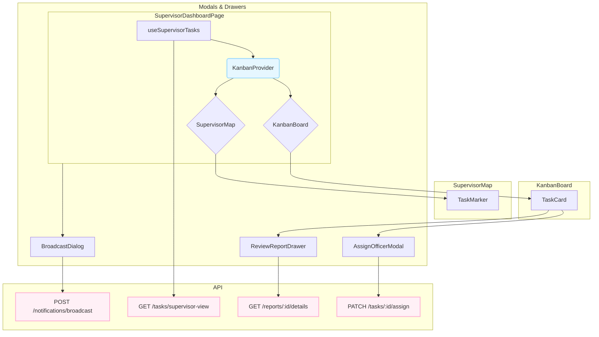

```markdown
# Sprint 7: Supervisor Dashboard - Component Architecture

**Objective:** This document outlines the frontend component architecture for the Supervisor Dashboard, detailing the hierarchy, data flow, and state management.

---

## High-Level Architecture

The Supervisor Dashboard is built as a self-contained module rooted in the `SupervisorDashboardPage`. It leverages a centralized `KanbanContext` for state management, ensuring that the `KanbanBoard` and `SupervisorMap` components are always in sync.

```
SupervisorDashboardPage
│
├── KanbanProvider (Context Wrapper)
│   ├── KanbanBoard
│   │   ├── KanbanColumn (x4)
│   │   │   └── TaskCard
│   │   │       ├── AssignOfficerModal
│   │   │       └── ReviewReportDrawer
│   │
│   └── SupervisorMap
│       ├── TaskMarker (with Clustering)
│       └── MapPopup
│
└── BroadcastDialog
```

---

## State Management: `KanbanContext`

The `KanbanContext` is the single source of truth for the dashboard's state. It is responsible for:

- **`tasks`**: Storing the array of all tasks fetched from the API.
- **`selectedTaskId`**: The ID of the currently selected task, shared between the Kanban board and the map.
- **`selectTask(taskId)`**: Action to update the `selectedTaskId`.
- **`refreshTasks()`**: Function to trigger a re-fetch of all task data.

This centralized approach prevents prop-drilling and ensures that when a task is selected in one component (e.g., the map), the other component (e.g., the Kanban board) reacts accordingly.

---

## Core Components

### 1. `SupervisorDashboardPage.tsx`

- **Role:** The main container for the entire dashboard.
- **Responsibilities:**
    - Fetches initial task data using the `useSupervisorTasks` hook.
    - Manages the open/close state for the `BroadcastDialog`.
    - Wraps the main layout components with the `KanbanProvider`.

### 2. `KanbanBoard.tsx`

- **Role:** Displays tasks in four columns based on their status.
- **Responsibilities:**
    - Consumes `KanbanContext` to get the list of tasks.
    - Filters tasks into four arrays, one for each status column (`PENDING_ASSIGNMENT`, `IN_PROGRESS`, `SURVEYED`, `COMPLETED`).
    - Renders a `KanbanColumn` for each status, passing the filtered tasks.

### 3. `TaskCard.tsx`

- **Role:** Represents a single task in the Kanban board.
- **Responsibilities:**
    - Displays key task information (priority, title, location).
    - Triggers `selectTask` from the context when clicked.
    - Conditionally renders action buttons based on task status:
        - "มอบหมายงาน" button for `PENDING_ASSIGNMENT` status, which opens the `AssignOfficerModal`.
        - "ตรวจสอบ" button for `SURVEYED` status with a `PENDING_REVIEW` report, which opens the `ReviewReportDrawer`.

### 4. `SupervisorMap.tsx`

- **Role:** Provides a geographical overview of all tasks.
- **Responsibilities:**
    - Consumes `KanbanContext` to get tasks and the `selectedTaskId`.
    - Uses `react-leaflet` and `react-leaflet-cluster` to render `TaskMarker` components.
    - Implements 2-way sync:
        - **Map -> Kanban:** When a marker is clicked, it calls `selectTask` to update the context.
        - **Kanban -> Map:** It listens for changes to `selectedTaskId` and uses `flyTo` to pan the map to the selected marker.

---

## Modal & Drawer Components

These components are self-contained and manage their own internal state, but are triggered from the `TaskCard` or `SupervisorDashboardPage`.

### 1. `AssignOfficerModal.tsx`

- **Triggered by:** `TaskCard` (for `PENDING_ASSIGNMENT` tasks).
- **Hooks:** `useAvailableOfficers` to fetch and manage the list of field officers.
- **Functionality:**
    - Allows searching and sorting of officers.
    - Handles the API call to assign an officer to the task.
    - On success, it calls `refreshTasks` from the context to update the UI.

### 2. `ReviewReportDrawer.tsx`

- **Triggered by:** `TaskCard` (for `PENDING_REVIEW` reports).
- **Hooks:** `useReportDetails` to fetch the detailed report and handle approve/reject actions.
- **Functionality:**
    - Displays a comprehensive, read-only view of a submitted report.
    - Provides "Approve" and "Request Revision" actions.
    - Includes confirmation dialogs for both actions.
    - On success, it calls `refreshTasks` to update the UI.

### 3. `BroadcastDialog.tsx`

- **Triggered by:** `SupervisorDashboardPage`.
- **Hooks:** `useBroadcast` to handle the API call for sending the broadcast.
- **Functionality:**
    - A simple form for the supervisor to send a message to all staff or just field officers.
    - Includes form validation for title, message, priority, and target.

---

## Data Flow Diagram



This architecture ensures a clear separation of concerns, a unidirectional data flow (with the context as the central dispatcher), and high reusability of components.
```
