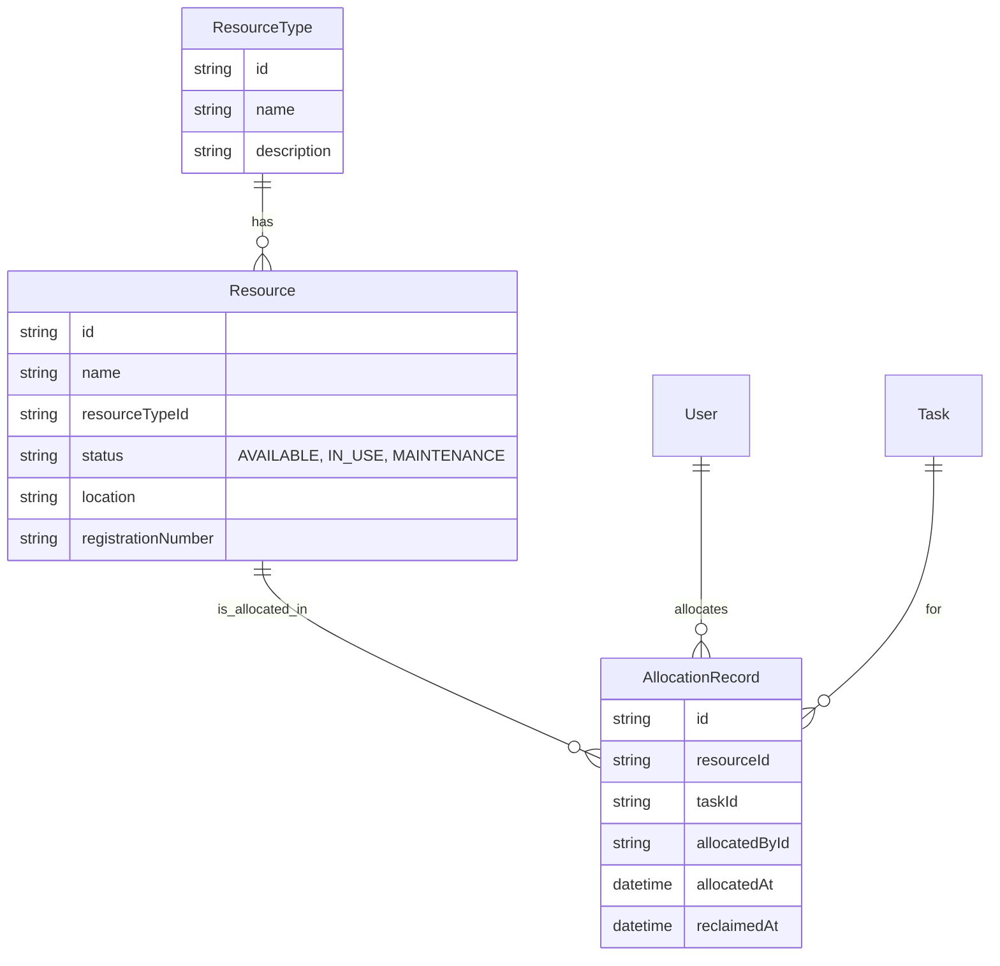

# Sprint 9: Resource Management Module - Technical Specification

**Version:** 1.0
**Date:** 2025-11-10
**Author:** Manus AI

This document outlines the technical design, data models, and API contracts for the Resource Management Module.

---

## 1. Entity Definitions

This section defines the core data models for the module. The relationships are designed to be scalable and maintainable within the existing Prisma schema.

### 1.1. ERD (Entity Relationship Diagram)

### 1.2. Entity Details

#### `ResourceType`
Stores the different categories of resources.

| Field | Type | Description | Example |
| :--- | :--- | :--- | :--- |
| `id` | `String` | Unique identifier (UUID) | `cuid()` |
| `name` | `String` | Name of the resource type | "ยานพาหนะ", "อุปกรณ์สื่อสาร" |
| `description` | `String?` | Optional description | "รถกระบะ, รถพยาบาล" |

#### `Resource`
Represents an individual resource item.

| Field | Type | Description | Example |
| :--- | :--- | :--- | :--- |
| `id` | `String` | Unique identifier (UUID) | `cuid()` |
| `name` | `String` | Specific name of the resource | "รถกระบะ Isuzu D-Max" |
| `resourceTypeId` | `String` | Foreign key to `ResourceType` | `...` |
| `status` | `ResourceStatus` | Enum: `AVAILABLE`, `IN_USE`, `MAINTENANCE` | `AVAILABLE` |
| `location` | `String` | Physical storage location | "คลัง A, ชั้น 2" |
| `registrationNumber` | `String?` | Unique identifier (e.g., license plate) | "กท-1234" |
| `createdAt` | `DateTime` | Timestamp of creation | `@default(now())` |
| `updatedAt` | `DateTime` | Timestamp of last update | `@updatedAt` |

#### `AllocationRecord`
Tracks the allocation history of a resource to a specific task or incident.

| Field | Type | Description | Example |
| :--- | :--- | :--- | :--- |
| `id` | `String` | Unique identifier (UUID) | `cuid()` |
| `resourceId` | `String` | Foreign key to `Resource` | `...` |
| `taskId` | `String` | Foreign key to `Task` | `...` |
| `allocatedById` | `String` | Foreign key to `User` (who allocated) | `...` |
| `allocatedAt` | `DateTime` | Timestamp when allocated | `@default(now())` |
| `reclaimedAt` | `DateTime?` | Timestamp when reclaimed (returned) | `null` |

---

## 2. REST API Design

All endpoints will be under the `/api/resources` prefix.

### 2.1. ResourceType API

| Method | Endpoint | Description | Success Response |
| :--- | :--- | :--- | :--- |
| `GET` | `/types` | Get all resource types | `200 OK` - `ResourceType[]` |
| `POST` | `/types` | Create a new resource type | `201 Created` - `ResourceType` |

### 2.2. Resource API

| Method | Endpoint | Description | Success Response |
| :--- | :--- | :--- | :--- |
| `GET` | `/` | Get all resources with filters | `200 OK` - `Resource[]` |
| `POST` | `/` | Create a new resource | `201 Created` - `Resource` |
| `GET` | `/:id` | Get a single resource by ID | `200 OK` - `Resource` |
| `PATCH` | `/:id` | Update a resource | `200 OK` - `Resource` |
| `DELETE` | `/:id` | Delete a resource | `204 No Content` |

### 2.3. Allocation API

| Method | Endpoint | Description | Success Response |
| :--- | :--- | :--- | :--- |
| `POST` | `/:id/allocate` | Allocate a resource to a task | `201 Created` - `AllocationRecord` |
| `POST` | `/reclaim/:allocationId` | Reclaim a resource from a task | `200 OK` - `AllocationRecord` |
| `GET` | `/:id/history` | Get allocation history for a resource | `200 OK` - `AllocationRecord[]` |

---

## 3. Validation Rules (DTOs)

#### `CreateResourceTypeDto`
- `name`: `string`, `required`, `min:3`

#### `CreateResourceDto`
- `name`: `string`, `required`, `min:3`
- `resourceTypeId`: `string`, `required`, `uuid`
- `status`: `enum`, `optional`, default: `AVAILABLE`
- `location`: `string`, `required`
- `registrationNumber`: `string`, `optional`

#### `UpdateResourceDto`
- All fields from `CreateResourceDto` are `optional`.

#### `AllocateResourceDto`
- `taskId`: `string`, `required`, `uuid`

---

## 4. Role Access Matrix

| Endpoint | Role: ADMIN | Role: EXECUTIVE | Role: SUPERVISOR | Role: FIELD_OFFICER |
| :--- | :--- | :--- | :--- | :--- |
| `GET /resources/types` | ✅ Read | ✅ Read | ✅ Read | ✅ Read |
| `POST /resources/types` | ✅ Write | ❌ Deny | ❌ Deny | ❌ Deny |
| `GET /resources` | ✅ Read | ✅ Read | ✅ Read | ❌ Deny |
| `POST /resources` | ✅ Write | ❌ Deny | ✅ Write | ❌ Deny |
| `GET /resources/:id` | ✅ Read | ✅ Read | ✅ Read | ❌ Deny |
| `PATCH /resources/:id` | ✅ Write | ❌ Deny | ✅ Write | ❌ Deny |
| `DELETE /resources/:id` | ✅ Write | ❌ Deny | ❌ Deny | ❌ Deny |
| `POST /resources/:id/allocate` | ✅ Write | ❌ Deny | ✅ Write | ❌ Deny |
| `POST /resources/reclaim/:id` | ✅ Write | ❌ Deny | ✅ Write | ❌ Deny |
| `GET /resources/:id/history` | ✅ Read | ✅ Read | ✅ Read | ❌ Deny |

---

## 5. Preliminary Component Structure (Frontend)

- **`/pages/resources/ResourceDashboardPage.tsx`**: Main page, contains the layout and child components.
- **`/components/resources/ResourceList.tsx`**: Table/Grid to display all resources.
- **`/components/resources/ResourceFilterBar.tsx`**: Component for filtering resources.
- **`/components/resources/ResourceForm.tsx`**: Modal/Drawer form for creating and editing resources.
- **`/components/resources/AllocationDialog.tsx`**: Modal for allocating a resource to a task.
- **`/components/resources/HistoryDrawer.tsx`**: Drawer to show the allocation history of a resource.
- **`/hooks/useResources.ts`**: Custom hook for fetching and managing resource data (CRUD).
- **`/hooks/useAllocation.ts`**: Custom hook for managing resource allocation and reclamation.
